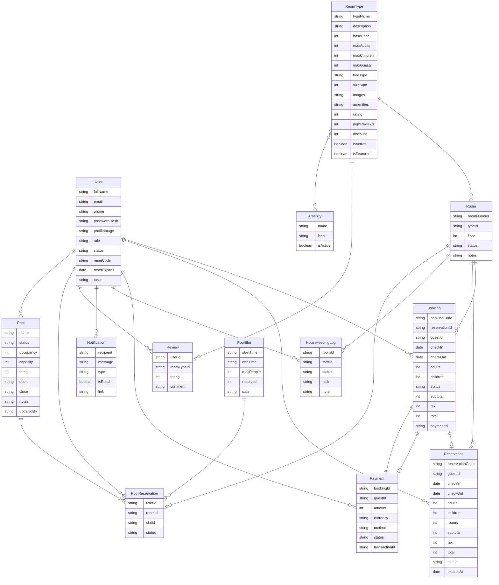

# Hotel Management System ERD

This document provides a visual representation of the data models and their relationships.

> [!IMPORTANT]
> **If you are using [Mermaid Live Editor (Mermaid.Ai)](https://mermaid.live/):**
> DO NOT copy this entire file. Copy **ONLY** the code inside the block below (starting from `erDiagram`).
> Alternatively, use the raw code file: [ERD_Code.mermaid](file:///d:/HotelManagementSystem/ERD_Code.mermaid)

## Mermaid.js Diagram

