# Comftay - Modern Hotel Management System

Comftay is a premium, full-stack hotel management solution designed to streamline operations, enhance guest experiences, and provide detailed operational insights. Built with a modern tech stack (React, TypeScript, Node.js, MongoDB), it features a high-end UI with full dark mode support and a robust role-based access system.

## 🌟 Key Features

### 🏨 Core Management
- **Intelligent Booking Engine**: A responsive, real-time booking bar with precise availability feedback and automated reservation expiry (15-minute hold).
- **Infinity Pool & Spa Reservation**: A time-based booking system with 1-hour slots, atomic availability management, and automated capacity control.
- **Dynamic Room Management**: Support for customized Room Types, individual Room status tracking (Occupied, Cleaning, Out of Service), and Amenity management.
- **Housekeeping Automation**: Automated task assignment upon guest check-out, real-time status updates for pool cleaning, and maintenance logging.

### 👤 User Roles & Dashboards
- **Admin**: Full system control, user management, and core configuration.
- **Manager**: Operational analytics, staff performance, and revenue reporting.
- **Receptionist**: Efficient front-desk operations including Check-in/Check-out flows and reservation oversight.
- **Housekeeping**: Mobile-optimized task list for cleaning assignments and room status reporting.
- **Guest**: Seamless booking experience, profile management, and reservation history tracking.

### 🔔 Advanced Notification System
- **Real-time Alerts**: Staff receives instant notifications for new task assignments (e.g., room cleaning).
- **Management Features**: Optimistic "Clear All" functionality (instant list clearing) and "Mark all as read" for efficient inbox management.
- **Clean UI**: Visual loading states and automated "All Caught Up" empty state views.

### 📊 Dashboard & Reporting
- **Revenue Exports**: Managers and Admins can download high-fidelity **Excel** (.xlsx) and professional **PDF** reports for annual and monthly revenue data.
- **Visual Analytics**: The system uses `exceljs` for branded spreadsheets and `pdfkit-table` for structured, printable PDF documents.
- **Performance Optimized**: Aggregation-based reporting ensures fast generation even with high transaction volumes.

### 🎨 Design & Experience
- **Premium Aesthetics**: Glassmorphism elements, vibrant color palettes, and smooth micro-animations.
- **Full Dark Mode**: A unified design system that adapts perfectly to dark and light modes across all modules.
- **Responsive Design**: Fully optimized for Desktop, Tablet, and Mobile devices.

---

## 🛠️ Technology Stack

| Layer | Technologies |
| :--- | :--- |
| **Frontend** | React 19, TypeScript, Tailwind CSS, Redux Toolkit, Lucide React, date-fns |
| **Backend** | Node.js, Express (Express 5/path-to-regexp), TypeScript |
| **Database** | MongoDB with Mongoose ODM |
| **Auth** | JWT (JSON Web Tokens) with Bcrypt password hashing |
| **Media** | Cloudinary (Image storage & transformation) |
| **Comms** | Nodemailer (Email notifications) |
| **Reporting**| ExcelJS, PDFKit, PDFKit-Table |

---

## 📂 Project Structure

```
HotelManagementSystem/
├── client/                 # React frontend (Vite)
│   ├── src/
│   │   ├── components/     # Reusable UI & Layout components
│   │   ├── pages/          # Feature-specific pages (Admin, Booking, etc.)
│   │   ├── store/          # Redux State Management (Slices)
│   │   ├── services/       # API integration layers
│   │   └── types/          # Shared TypeScript interfaces
├── server/                 # Node.js backend (Express)
│   ├── src/
│   │   ├── controllers/    # API Route handlers (Auth, Report, Pool, etc.)
│   │   ├── models/         # Mongoose Schemas
│   │   ├── routes/         # API Endpoint definitions
│   │   └── middleware/     # Auth, Roles & File Upload logic
```

---

## 🚀 Getting Started

### Prerequisites
- **Node.js**: v18+
- **MongoDB**: Local instance or Atlas Cloud URI
- **Cloudinary Account**: For room/profile image uploads

### Installation

1. **Clone & Navigate**
   ```bash
   git clone <repository-url>
   cd HotelManagementSystem
   ```

2. **Backend Setup**
   ```bash
   cd server
   npm install
   # Create .env based on the variables below
   npm run dev
   ```

3. **Frontend Setup**
   ```bash
   cd ../client
   npm install
   # Create .env based on the variables below
   npm run dev
   ```

### Environment Variables

**Server (`server/.env`)**
```env
PORT=4000
MONGODB_URI=your_mongodb_connection_string
JWT_SECRET=your_secure_secret
CLOUDINARY_CLOUD_NAME=name
CLOUDINARY_API_KEY=key
CLOUDINARY_API_SECRET=secret
EMAIL_USER=your_email
EMAIL_PASS=your_email_app_password
```

**Client (`client/.env`)**
```env
VITE_API_BASE_URL=http://localhost:4000/api
```

---

## 🌐 Deployment (Render Blueprints)

Comftay is optimized for one-click deployment using **Render Blueprints**. The root `render.yaml` file defines a multi-service architecture:

### 1. Backend Service (Web Service)
- **Runtime**: Node.js
- **Environment**: Connection strings in `render.yaml` (link your own MongoDB Atlas cluster).
- **CORS**: Automatically configured via the `FRONTEND_URL` environment variable.

### 2. Frontend Site (Static Site)
- **Runtime**: Static
- **Internal Linking**: The frontend automatically resolves the backend API via the `VITE_API_BASE_URL` environment variable.

### Quick Start Deployment
1. Connect your GitHub repository to **Render**.
2. Select **Blueprint** when prompted.
3. Render will automatically detect `render.yaml` and provision all services.

---

## 📡 API Reference

### Auth
| Method | Endpoint | Description |
| :--- | :--- | :--- |
| `POST` | `/api/auth/register` | Register a new guest |
| `POST` | `/api/auth/login` | Authenticate user & return JWT |
| `POST` | `/api/auth/forgot-password` | Request password reset email |
| `POST` | `/api/auth/reset-password` | Set new password with reset code |

### Rooms & Facilities
| Method | Endpoint | Description |
| :--- | :--- | :--- |
| `GET` | `/api/rooms` | Fetch rooms with filters |
| `PATCH`| `/api/rooms/:id/status` | Update room status (Staff only) |
| `GET` | `/api/rooms/types` | List all room categories |
| `GET` | `/api/pool/slots` | Fetch time-based pool availability |
| `POST` | `/api/pool/reserve` | Book a private pool/spa slot |
| `PATCH`| `/api/pool/reservation/:id/cancel` | Cancel a pool slot |

### Bookings & Reservations
| Method | Endpoint | Description |
| :--- | :--- | :--- |
| `POST` | `/api/reservations` | Create a temporary 15-min hold |
| `GET` | `/api/reservations/my` | View guest's personal reservations |
| `POST` | `/api/bookings` | Finalize booking & confirm stay |
| `GET` | `/api/bookings/:id/invoice`| Generate digital receipt |
| `POST` | `/api/bookings/:id/confirm-payment` | Manually mark as paid (Staff) |

### Housekeeping & Maintenance
| Method | Endpoint | Description |
| :--- | :--- | :--- |
| `GET` | `/api/housekeeping` | List all task logs |
| `PATCH`| `/api/housekeeping/:id/status` | Update task progress |
| `PATCH`| `/api/housekeeping/:id/assign` | Delegate task to staff member |

### Reporting & Analytics
| Method | Endpoint | Description |
| :--- | :--- | :--- |
| `GET` | `/api/reports/revenue/excel` | Export annual revenue to Excel |
| `GET` | `/api/reports/revenue/pdf` | Export annual revenue to PDF |
| `GET` | `/api/dashboard/stats` | Operational KPIs & Chart data |

### Profile & Notifications
| Method | Endpoint | Description |
| :--- | :--- | :--- |
| `GET` | `/api/profile` | Get current user's profile |
| `POST` | `/api/profile/image` | Upload/Update profile picture |
| `GET` | `/api/notifications` | Fetch user alerts |
| `DELETE`| `/api/notifications/clear-all` | Clear all notifications |

---

## 📐 UML Diagrams

### 1. Class Diagram — Data Models

> Shows all Mongoose models, their fields, enumerations, and relationships.


---

### 2. Use Case Diagram — Role-Based Access

> Illustrates which actors can perform which operations in the system.

```mermaid
graph LR
    Guest(["👤 Guest"])
    Receptionist(["🏨 Receptionist"])
    Housekeeping(["🧹 Housekeeping"])
    Manager(["📊 Manager"])
    Admin(["⚙️ Admin"])

    subgraph Public ["🌐 Public"]
        UC1["Browse Rooms"]
        UC2["Register / Login"]
        UC3["View Amenities & Offers"]
    end

    subgraph GuestFeatures ["🛎️ Guest Features"]
        UC4["Search & Book Rooms"]
        UC5["View My Reservations"]
        UC6["Reserve Pool Slot"]
        UC7["Write a Review"]
        UC8["Manage Profile"]
    end

    subgraph StaffFeatures ["🏢 Staff Operations"]
        UC9["Check-in / Check-out Guest"]
        UC10["Manage Reservations"]
        UC11["Manage Bookings"]
        UC12["Manage Pool Status"]
        UC13["View Room Status"]
    end

    subgraph HousekeepingFeatures ["🧹 Housekeeping"]
        UC14["View Task List"]
        UC15["Update Room Cleaning Status"]
    end

    subgraph ManagerFeatures ["📈 Management"]
        UC16["View Analytics Dashboard"]
        UC17["Assign Housekeeping Tasks"]
        UC18["Manage Room Types"]
        UC19["Manage Amenities"]
        UC20["Export Revenue Reports"]
        UC21["Manage Users"]
    end

    subgraph AdminFeatures ["⚙️ Administration"]
        UC22["Full System Control"]
        UC23["Manage All Staff Accounts"]
        UC24["Configure System Settings"]
    end

    Guest --> UC1 & UC2 & UC3
    Guest --> UC4 & UC5 & UC6 & UC7 & UC8

    Receptionist --> UC9 & UC10 & UC11 & UC12 & UC13
    Receptionist --> UC1 & UC3

    Housekeeping --> UC14 & UC15

    Manager --> UC16 & UC17 & UC18 & UC19 & UC20 & UC21
    Manager --> UC9 & UC10 & UC11 & UC12 & UC13

    Admin --> UC22 & UC23 & UC24
    Admin --> UC16 & UC17 & UC18 & UC19 & UC20 & UC21
    Admin --> UC9 & UC10 & UC11 & UC12 & UC13
```



---

### 3. Sequence Diagram — Guest Booking Flow

> Shows the full lifecycle from room search to booking confirmation.

```mermaid
sequenceDiagram
    actor Guest
    participant Frontend as React Frontend
    participant API as Express API
    participant DB as MongoDB

    Guest->>Frontend: Search available rooms (dates, guests)
    Frontend->>API: GET /api/rooms?checkIn=...&checkOut=...
    API->>DB: Query available rooms
    DB-->>API: Return room list
    API-->>Frontend: Room results
    Frontend-->>Guest: Display available rooms

    Guest->>Frontend: Select room & initiate booking
    Frontend->>API: POST /api/reservations (15-min hold)
    API->>DB: Create Reservation (status: PENDING, expiresAt: +15min)
    DB-->>API: Reservation created
    API-->>Frontend: { reservationCode, expiresAt }
    Frontend-->>Guest: Redirect to Booking Page (timer starts)

    Guest->>Frontend: Fill guest details & confirm
    Frontend->>API: POST /api/bookings
    API->>DB: Create Booking (status: PENDING_PAYMENT)
    API->>DB: Update Reservation status → CONFIRMED
    DB-->>API: Booking created
    API-->>Frontend: { bookingCode }

    Guest->>Frontend: Submit payment
    Frontend->>API: POST /api/bookings/:id/confirm-payment
    API->>DB: Create Payment record (status: COMPLETED)
    API->>DB: Update Booking status → CONFIRMED
    DB-->>API: Updated
    API-->>Frontend: Booking confirmed
    Frontend-->>Guest: Show confirmation page & invoice
```



---

### 4. Sequence Diagram — Check-Out & Housekeeping Automation

> Shows how a check-out triggers automatic room cleaning task assignment.

```mermaid
sequenceDiagram
    actor Receptionist
    participant Frontend as React Frontend
    participant API as Express API
    participant DB as MongoDB
    actor HKStaff as Housekeeping Staff

    Receptionist->>Frontend: Marks guest as Checked-Out
    Frontend->>API: PATCH /api/bookings/:id/checkout
    API->>DB: Update Booking status → CHECKED_OUT
    API->>DB: Update Room status → DIRTY
    API->>DB: Create HousekeepingLog (status: DIRTY, task: "Post checkout clean")
    API->>DB: Create Notification for housekeeping staff
    DB-->>API: All records updated
    API-->>Frontend: Success
    Frontend-->>Receptionist: Room marked as dirty

    HKStaff->>Frontend: Opens Housekeeping Dashboard
    Frontend->>API: GET /api/housekeeping (my tasks)
    API->>DB: Query HousekeepingLogs for staffId
    DB-->>API: Task list
    API-->>Frontend: Task list with dirty room
    Frontend-->>HKStaff: Shows cleaning task

    HKStaff->>Frontend: Starts cleaning → Updates status to CLEANING
    Frontend->>API: PATCH /api/housekeeping/:id/status
    API->>DB: Update HousekeepingLog status → CLEANING
    API->>DB: Update Room status → CLEANING
    DB-->>API: Updated
    API-->>Frontend: Status updated

    HKStaff->>Frontend: Finishes → Updates status to CLEAN
    Frontend->>API: PATCH /api/housekeeping/:id/status
    API->>DB: Update HousekeepingLog status → CLEAN
    API->>DB: Update Room status → AVAILABLE
    DB-->>API: Updated
    API-->>Frontend: Room now available
```



---

### 5. State Machine — Booking Lifecycle

> Tracks all possible status transitions of a `Booking` document.


---

### 6. State Machine — Reservation Lifecycle

> Tracks all possible status transitions of a temporary 15-minute `Reservation`.


---

### 7. State Machine — Room Availability

> Tracks room status through the full guest stay lifecycle.


---

### 8. State Machine — Pool Slot Lifecycle

> Tracks pool reservation states from booking to completion.


---

### 9. Component Architecture — Frontend

> Shows how the React application is organized into layers and pages by role.


---

### 10. Component Architecture — Backend

> Shows how the Express server layers — routes, controllers, middleware, and models — are organized.

```mermaid
graph TD
    Client["⚛️ React Client"]

    subgraph Server ["🖥️ Express Server (Node.js + TypeScript)"]
        subgraph Middleware ["🛡️ Middleware"]
            AuthMW["authenticate (JWT Verify)"]
            RoleMW["authorize (Role Check)"]
            UploadMW["upload (Multer + Cloudinary)"]
        end

        subgraph Routes ["🛣️ Routes"]
            AuthR["authRoutes"]
            RoomR["roomRoutes"]
            ResR["reservationRoutes"]
            BookR["bookingRoutes"]
            PayR["paymentRoutes"]
            HKR["housekeepingRoutes"]
            PoolR["poolRoutes"]
            UserR["userRoutes"]
            ProfileR["profileRoutes"]
            NotifR["notificationRoutes"]
            ReviewR["reviewRoutes"]
            ReportR["reportRoutes"]
            DashR["dashboardRoutes"]
        end

        subgraph Controllers ["⚙️ Controllers"]
            AuthC["authController"]
            RoomC["roomController"]
            RoomTypeC["roomTypeController"]
            ResC["reservationController"]
            BookC["bookingController"]
            HKC["housekeepingController"]
            PoolC["poolController"]
            UserC["userController"]
            ProfileC["profileController"]
            NotifC["notificationController"]
            ReviewC["reviewController"]
            ReportC["reportController"]
            DashC["dashboardController"]
        end

        subgraph Models ["🗄️ Mongoose Models"]
            UserM["User"]
            RoomM["Room"]
            RoomTypeM["RoomType"]
            AmenityM["Amenity"]
            ResM["Reservation"]
            BookM["Booking"]
            PayM["Payment"]
            HKM["HousekeepingLog"]
            PoolM["Pool"]
            PoolSlotM["PoolSlot"]
            PoolResM["PoolReservation"]
            NotifM["Notification"]
            ReviewM["Review"]
        end
    end

    MongoDB[("🍃 MongoDB Atlas")]
    Cloudinary["☁️ Cloudinary"]
    Email["📧 Nodemailer"]

    Client -->|"HTTP / REST"| Routes
    Routes --> Middleware --> Controllers
    Controllers --> Models
    Models --> MongoDB
    Controllers --> Cloudinary
    Controllers --> Email
```



---

### 11. Entity Relationship Diagram (ERD)

> Represents the complete data model with all entity relationships.

